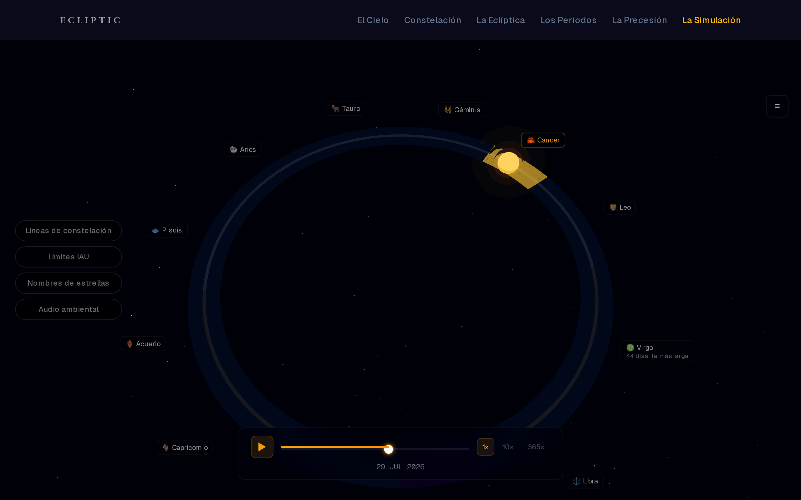
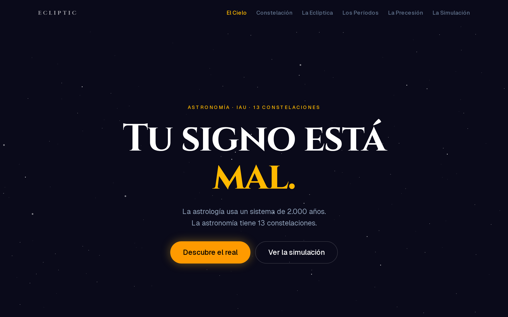
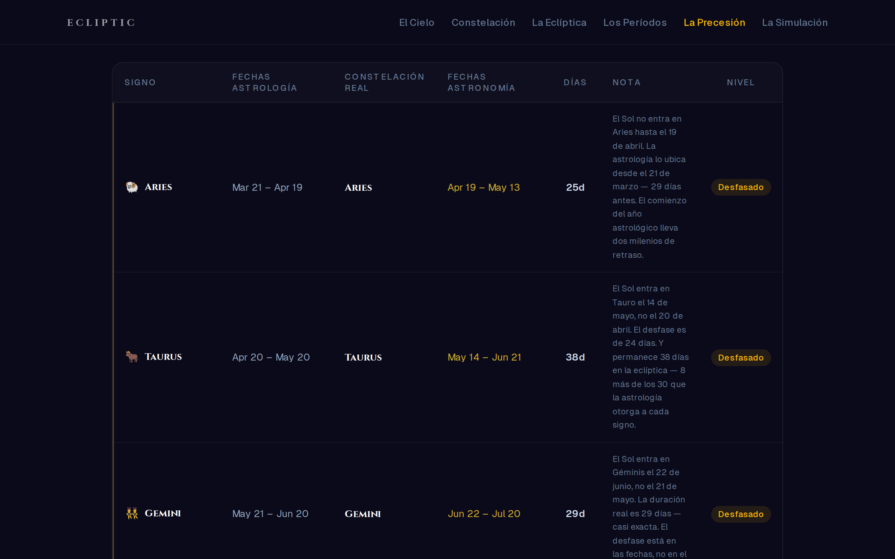
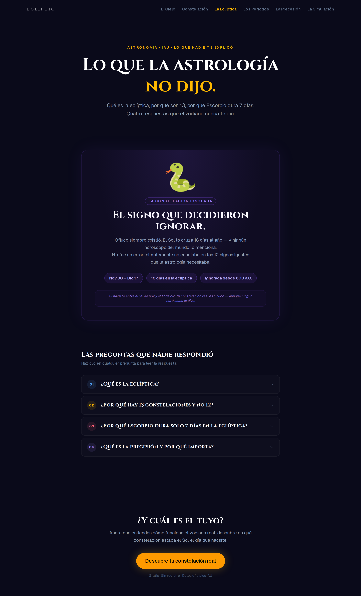

<div align="center">

# Ecliptic Explorer

### Your real zodiac sign, based on astronomy — not astrology

An interactive 3D visualization of the Sun's actual path along the ecliptic. Astrology divides the year into 12 equal 30-day signs. Astronomy says the Sun crosses **13 constellations** of wildly unequal length — from 44 days in Virgo to just 7 in Scorpius — including Ophiuchus, the one the tropical zodiac left out.

**Next.js 16 · TypeScript · React Three Fiber · Three.js · Zustand · Framer Motion · Tailwind CSS v4 · Vitest**

**[Live demo](https://ecliptic-explorer.vercel.app) · [Source](https://github.com/dacq7/ecliptic-explorer)**

<br>


</div>

---

> **Note on language:** the user interface is in **Spanish** (`lang="es"`). This README is in English; the app itself is not yet localized.

---

<!-- SCREENSHOTS — uncomment once the PNGs are committed to .github/screenshots/

## Screenshots

### The simulation — the Sun on the ecliptic ring

*The 13 IAU constellations rendered as proportional arcs — arc length is the real number of days the Sun spends in each. Scorpius is the sliver; Virgo is the wide one.*

### The calculator — your real constellation

*Enter a birth date, get the IAU constellation the Sun was actually in, next to the traditional sign for comparison.*

<details>
<summary><b>More screenshots</b></summary>

| | |
|---|---|
|  **Landing** |  **Durations** |
|  **Astronomy vs astrology** |  **Learn** |

</details>

-->

---

## What is this?

The zodiac most people know was fixed roughly 2,000 years ago: twelve signs, each exactly 30° of sky, each about a month long. It is a tidy calendar, and it stopped matching the sky almost immediately.

Two things broke it. First, **precession** — the Earth's axis wobbles on a ~26,000-year cycle, which has shifted the tropical signs about a full month out of alignment with the constellations they were named after. Second, and more fundamentally, **the constellations were never equal in the first place**. When the International Astronomical Union drew official constellation boundaries in 1930, the ecliptic — the plane of Earth's orbit, along which the Sun appears to travel — turned out to pass through *thirteen* of those regions, and to linger in each for a very different number of days.

So the Sun spends **44 days** in Virgo and **7 days** in Scorpius. And for **18 days** between November 30 and December 17, it sits in **Ophiuchus**, the Serpent Bearer — a constellation the tropical zodiac has no slot for at all.

Ecliptic Explorer makes that visible rather than merely stating it. You can enter a birth date and see which constellation the Sun was actually in, compare all thirteen periods side by side as proportional bars, read why the discrepancy exists, and — the centerpiece — watch the Sun travel a 3D ecliptic ring where each constellation's arc is sized by its true duration, surrounded by real stars plotted from their catalog coordinates.

It is not a horoscope generator. There are no personality readings and nothing to buy. It is a visualization of a real astronomical fact that happens to be genuinely surprising.

---

## Features

| Route | What it does |
|---|---|
| **`/`** | Landing page — animated CSS starfield, the 13-vs-12 premise, and proportional duration bars built from the real dataset |
| **`/calculator`** | Enter a birth date → IAU constellation, its date range and duration, the traditional sign for contrast, and whether the two disagree. Generates share text |
| **`/simulation`** | The 3D centerpiece — Sun orbiting a proportionally-divided ecliptic ring, real stars, constellation stick figures, time controls |
| **`/durations`** | All 13 constellations as horizontal bars, sorted and scaled to real duration, with an expandable detail panel per constellation |
| **`/compare`** | Astronomy vs astrology, sign by sign — a semantic table on desktop, cards on mobile, with discrepancies graded by severity |
| **`/learn`** | Educational accordion: what the ecliptic is, why Ophiuchus exists, why Scorpius gets only 7 days, what precession did |

### Inside the simulation

- **Proportional ecliptic ring** — the 360° ring is divided by `durationDays`, so each constellation's arc is its real share of the year. Sagittarius starts at the top (90°) and angles increase clockwise.
- **Explorer toggles** — constellation stick figures, IAU boundary regions, and star names can each be switched on and off.
- **Time controls** — scrub any date on the slider, or play at **1×, 10×, or 365×**.
- **Responsive 3D** — layout mode is resolved by a single hook (`useLayoutMode`) across portrait phone, landscape phone, tablet and desktop, each with its own camera framing, label sizing and panel geometry. Phones render the 19 primary stars; viewports ≥ 640px get the full 185.
- **Graceful degradation** — `useWebGLDetect` probes for a WebGL context at mount and falls back to a 2D rendering if the device can't provide one. A context-loss guard handles the GPU dropping the canvas mid-session.

---

## Tech Stack

| Layer | Technology | Version |
|---|---|---|
| **Framework** | Next.js (App Router) | 16.2.4 |
| **UI** | React | 19.2.4 |
| **Language** | TypeScript (`strict: true`) | 5.9.3 |
| **3D engine** | Three.js | 0.184.0 |
| **React renderer for Three** | @react-three/fiber | 9.6.1 |
| **3D helpers** | @react-three/drei | 10.7.7 |
| **State** | Zustand (three atomic stores) | 5.0.12 |
| **Animation** | Framer Motion | 12.38.0 |
| **Styling** | Tailwind CSS | 4.2.4 |
| **Testing** | Vitest + Testing Library + jsdom | 4.1.5 |
| **Fonts** | Cinzel (constellation names) + Geist (UI), via `next/font` | — |
| **Hosting** | Vercel | — |

No database, no authentication, no environment variables — the entire dataset is static TypeScript and every calculation runs locally.

---

## Technical Highlights

**The dataset is sourced and audited, not eyeballed.** The 13 constellation periods in `app/logic/constellations.ts` carry an inline verification log naming every source consulted — EarthSky's year-by-year solar transit data (2018, 2019, 2021), Wikipedia's `Template:Zodiac_date_IAU` (Shapiro 2011), and the IAU Office of Astronomy for Education. The audit caught a real error: Taurus was stored as 38 days when May 14 → Jun 21 inclusive is **39**. The `durationDays` values sum to exactly 365.

Dates carry a documented ±1 day tolerance year to year, because the Sun's crossing of a boundary doesn't fall at the same clock time every year. The dataset uses mean values and says so.

**Equatorial → ecliptic coordinate transform.** Stars are stored as catalog J2000 right ascension and declination and converted at render time in `app/simulation/utils/raDecToCanvas.ts`, using the standard rotation about the obliquity of the ecliptic (ε = 23.4393°):

```
sin β = sin δ · cos ε − cos δ · sin ε · sin α
λ     = atan2( sin δ · sin ε + cos δ · cos ε · sin α ,  cos δ · cos α )
```

Ecliptic longitude λ then maps to ring azimuth against a calibrated vernal-equinox offset, and ecliptic latitude β maps to canvas height. No positions are hand-placed.

**Real stars from real catalogs.** 19 primary named stars (Antares, Spica, Regulus, Aldebaran, Pollux, Rasalhague…) with J2000 coordinates, plus an extended set of **166 stars sourced from SIMBAD** — 185 in total. Apparent magnitude drives both point size and opacity, so the sky reads with the right relative brightness.

**Constellation stick figures from Stellarium.** The asterism geometry in `app/simulation/asterismData.ts` is **148 line segments across all 13 constellations**, built from Stellarium's `constellationship.fab` HIP-pair definitions and resolved to **147 unique Hipparcos stars** with J2000 coordinates.

**Solar position.** `getSolarLongitude()` implements the standard low-precision solar formula — mean longitude plus the first two equation-of-center terms — accurate to roughly ±1°, which is well inside what a visualization at this scale can show. The source cites Meeus, *Astronomical Algorithms* ch. 25 as the reference for a higher-precision implementation if one is ever needed.

**One source of truth for the domain logic.** `getConstellationByDate()` in `app/logic/zodiacLogic.ts` is pure TypeScript — no React, no I/O — and handles the genuinely tricky cases: Sagittarius wrapping the calendar year (Dec 18 → Jan 18, where `startDate > endDate` lexicographically), Feb 29 normalized to Feb 28 for lookup, and invalid input rejected with a descriptive error rather than a silent wrong answer.

**SEO is built, not bolted on.** Six dynamically generated Open Graph images via Next's `ImageResponse` (one per route, rendered with Cinzel on the project's own palette), a generated `sitemap.ts` and `robots.ts`, and JSON-LD structured data — `FAQPage` on `/learn`, `WebApplication` on `/calculator`, `WebSite` on `/`.

---

## Testing

```
app/logic/zodiacLogic.test.ts       45 tests
app/logic/eclipticAngles.test.ts    25 tests
app/simulation/TimeEngine.test.ts   30 tests
────────────────────────────────────────────
Total                              100 tests
```

```bash
npm test          # watch mode
npm run test:run  # single run
```

Coverage is concentrated where correctness actually matters: the date → constellation mapping and its edge cases (year wrap, leap day, boundary dates, malformed input), the proportional angle math that divides the ecliptic ring, and the calendar arithmetic behind the time engine — leap years, day-of-year conversion in both directions, and round-trip identity.

The `__tests__/` directory exists but is empty; tests live next to the code they cover.

---

## Project Structure

```
ecliptic-explorer/
├── app/
│   ├── page.tsx                  # Landing
│   ├── calculator/               # Date → constellation, result card, share text
│   ├── simulation/               # 3D system — canvas, orbit, stars, asterisms, controls
│   │   ├── SolarCanvas.tsx       #   R3F canvas root
│   │   ├── SolarPosition.ts      #   Ecliptic longitude of the Sun
│   │   ├── TimeEngine.ts         #   Calendar arithmetic (tested)
│   │   ├── asterismData.ts       #   148 stick-figure segments, 147 HIP stars
│   │   ├── NamedStars.tsx        #   19 primary + 166 SIMBAD stars
│   │   └── utils/raDecToCanvas.ts#   Equatorial → ecliptic → canvas
│   ├── durations/  compare/  learn/
│   ├── logic/                    # Pure domain logic, zero React
│   │   ├── constellations.ts     #   The 13-constellation dataset + audit log
│   │   ├── zodiacLogic.ts        #   getConstellationByDate() (tested)
│   │   └── eclipticAngles.ts     #   Proportional ring geometry (tested)
│   ├── content/                  # All user-facing copy, no logic
│   ├── components/               # ui/ · shared/ · landing/ · compare/ · learn/
│   ├── hooks/                    # useZodiac, useSolarTime, useLayoutMode, …
│   ├── store/                    # Zustand: simulation · ui · user
│   ├── types/index.ts            # Domain types
│   ├── sitemap.ts  robots.ts     # SEO
│   └── */opengraph-image.tsx     # 6 dynamic OG images
└── public/
```

**Architectural rule:** domain logic lives in `app/logic/` and nowhere else. Components render, hooks adapt, stores hold state — but the date → constellation mapping has exactly one implementation, consumed by every surface that needs it.

---

## Getting Started

**Requirements:** Node.js 20+.

```bash
git clone https://github.com/dacq7/ecliptic-explorer.git
cd ecliptic-explorer
npm install
npm run dev
```

Open [http://localhost:3000](http://localhost:3000).

**No `.env` file is needed.** The project uses zero environment variables — no API keys, no database URL, no external services. `npm install && npm run dev` is the entire setup.

```bash
npm run build   # production build
npm start       # serve the production build
npm run lint    # ESLint
```

---

## Project Status

Six routes are live and deployed. The 3D simulation runs on phones, tablets and desktop with per-device camera framing and a 2D fallback for devices without WebGL.

Known gaps, stated plainly:

- **`/api/zodiac` is scaffolded, not implemented.** The route exists with its contract documented and returns `501 Not Implemented`. Nothing in the app depends on it — the client calls `getConstellationByDate()` directly.
- **The ambient audio toggle has no audio file yet.** The control is wired; the asset is not in the repo.
- **The UI is Spanish-only.** No i18n layer.

---

<div align="center">

Built by **Diego Correa** — [Veridis Dev](https://veridisdev.com)

</div>
